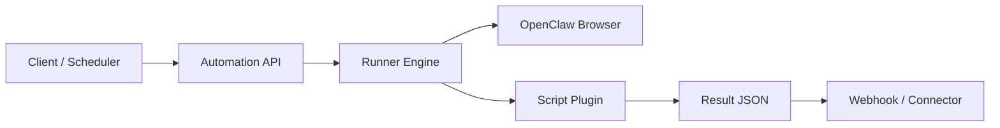

# OpenClaw Automation Kit

A production-focused framework for personal browser automations with a clear automation spec, API-first execution model, and optional messaging hooks.

This project is designed for people who want to:
- Run reliable browser automations using OpenClaw
- Share and version automations as scripts
- Expose a stable API for execution and scheduling
- Keep channel delivery (WhatsApp/iMessage/Slack/email) pluggable

## Why this exists

Most automation projects fail on structure: scripts are ad-hoc, outputs are inconsistent, and adding contributors is risky.

This repository provides:
- **Automation spec**: manifest + input/output schemas + deterministic entrypoint
- **Execution engine**: validate inputs, run script, normalize result
- **API hooks**: send results to webhooks or any downstream connector
- **Contribution model**: PR-friendly layout, CI checks, test expectations

## Architecture



## Repository layout

- `src/openclaw_automation/`: core engine and schema validator
- `library/`: PR-approved automation scripts
- `examples/`: onboarding/tutorial automations
- `schemas/`: JSON schemas for manifests and run payloads
- `scripts/`: utility CLI wrappers
- `tests/`: schema + engine tests
- `docs/`: architecture and contribution docs

## Quickstart

### 1. Install

If this is a fresh machine, do Git/SSH setup first:
- [`docs/DEVELOPER_SETUP.md`](docs/DEVELOPER_SETUP.md)

```bash
python3 -m venv .venv
source .venv/bin/activate
pip install -r requirements.txt
```

Configure keys locally:
```bash
cp .env.example .env
```
Then fill values per `docs/CONFIGURATION.md`.

## Platform support

The framework is intended to be cross-platform. Current practical testing has been on:
- macOS
- Linux (selected environments)

Windows support is expected but not yet broadly validated in real-world runs.  
If you hit Windows-specific issues, please open an issue or submit a PR.

### 2. Zero-credential quickstart (works immediately)

```bash
python -m openclaw_automation.cli run \
  --script-dir examples/public_page_check \
  --input '{"url":"https://www.yahoo.com","keyword":"news"}'
```

### 3. Validate example automation specs

```bash
python -m openclaw_automation.cli validate --script-dir examples/public_page_check
python -m openclaw_automation.cli validate --script-dir library/united_award
python -m openclaw_automation.cli validate --script-dir library/singapore_award
python -m openclaw_automation.cli validate --script-dir library/ana_award
python -m openclaw_automation.cli validate --script-dir library/bofa_alert
python -m openclaw_automation.cli validate --script-dir library/github_signin_check
```

### 4. Run an award example

```bash
python -m openclaw_automation.cli run \
  --script-dir library/united_award \
  --input '{"from":"SFO","to":["AMS","LIS","FCO"],"max_miles":120000,"days_ahead":30,"travelers":2,"cabin":"economy","credential_refs":{"airline_username":"openclaw/united/username","airline_password":"openclaw/united/password"}}'
```

Important for real runs:
- Award scripts require a human-loop path for 2FA (and often CAPTCHA).
- You must either:
  - connect a 2FA/messaging connector, or
  - watch for challenge messages and reply with the required code/token manually.

### 5. Run from plain English

```bash
python -m openclaw_automation.cli run-query \
  --query "Search ANA award travel economy from SFO to HND for 2 travelers in next 30 days under 120k miles" \
  --credential-refs '{"airline_username":"openclaw/ana/username","airline_password":"openclaw/ana/password"}'
```

This mode is optimized for award-travel style requests (airline + route + cabin + travelers + mileage cap).

It also supports public page checks:

```bash
python -m openclaw_automation.cli run-query \
  --query "Open https://www.yahoo.com and count mentions of news"
```

More English task examples:

```bash
python -m openclaw_automation.cli run-query \
  --query "Load https://www.wikipedia.org and check if \"encyclopedia\" appears on it"

python -m openclaw_automation.cli run-query \
  --query "Search United award travel business from SFO to AMS,LIS,FCO for 2 travelers in next 30 days under 120k miles"
```

## OpenClaw integration model

Scripts can call OpenClaw CLI (`openclaw browser ...`) or use a wrapper module. This kit does not hardcode a single OpenClaw strategy.

### OpenClaw-first, not OpenClaw-only

This toolkit is intentionally portable: the core runner is not locked to one browser stack.
You can run automations with OpenClaw, Playwright, or other browser drivers inside script runners.

We still recommend OpenClaw as the default path because it gives a strong base for:
- agent-friendly browser control
- human-in-the-loop 2FA/CAPTCHA workflows
- messaging-based checkpoints and resumes
- consistent orchestration across personal assistant automations

External BrowserAgent integration is supported via environment settings in
[`docs/CONFIGURATION.md`](docs/CONFIGURATION.md) (`OPENCLAW_USE_BROWSER_AGENT`, module path/name, CDP URL).

Current recommended reasoning path for smart browser automation is Claude vision-capable workflows.  
We welcome PRs for alternative providers/adapters (OpenAI, Gemini, local models), as long as they meet schema + test requirements.

Recommended pattern:
1. Script performs deterministic browser steps
2. Script emits normalized results (`matches`, `raw_observations`, `errors`)
3. API layer handles delivery and retries

See `library/united_award/runner.py` for the starter structure.

## Human-in-the-loop CAPTCHA

Read [`docs/CAPTCHA_HUMAN_LOOP.md`](docs/CAPTCHA_HUMAN_LOOP.md).

Recommended pattern:
1. Script detects challenge and captures screenshot + metadata.
2. Engine sends challenge event to user via webhook adapter.
3. User replies with solve instructions/token (for example tile indexes).
4. Script resumes with short-lived `resume_token`.

Also see:
- [`docs/MESSAGING_HUMAN_LOOP_SETUP.md`](docs/MESSAGING_HUMAN_LOOP_SETUP.md)
- [`docs/STARTER_EXAMPLES.md`](docs/STARTER_EXAMPLES.md)

## Security and credentials

Read [`docs/CREDENTIALS_AND_2FA.md`](docs/CREDENTIALS_AND_2FA.md) before deploying.

### Shared-responsibility warning

If you connect real account credentials + 2FA channels, this system can perform high-impact actions as that user.
Use only your own credentials in local/private secret stores and never share them.
You (the deployer/operator) are fully responsible for:
- secret storage hardening
- access control to the automation runtime
- approval gates for sensitive actions
- webhook and messaging channel security
- audit logging and incident response

If you cannot operate those controls safely, do not run credentialed automations.

### Branch safety for status updates

The status updater (`scripts/collect_automation_status.py --write-readme`) refuses to modify README on `main/master` by default.
Run it from your own branch, or explicitly override with `--allow-main-readme-update` in controlled CI.

That guide covers:
- macOS Keychain setup
- Linux/Windows secure store options
- webhook-based second-factor flow
- iMessage/WhatsApp connector scaffolding

Credential policy for this repo:
- Bring your own secrets store (OS keychain or cloud secret manager).
- Pass only `credential_refs` in script inputs.
- This project does **not** import/export credentials from password managers.
- If you already use a password manager, you can sync/copy credentials into your OS secret store
  (for example, Apple Keychain) and reference those entries from automations.

See also:
- [`docs/CONFIGURATION.md`](docs/CONFIGURATION.md)
- [`DISCLAIMER.md`](DISCLAIMER.md)

## Acceptable use

We do **not** condone use of this project to automate:
- accounts, systems, or data you do not legitimately own or have explicit authorization to access
- private sites/services without permission

Use is intended for:
- public websites
- your own authorized accounts and workflows

## Connectors (bring your own)

This repo intentionally keeps delivery adapters separate.

Use the webhook output from the runner to integrate with:
- WhatsApp API
- BlueBubbles / iMessage bridges
- Slack
- Email

## Building new automations

Read [`docs/NEW_AUTOMATION_PLAYBOOK.md`](docs/NEW_AUTOMATION_PLAYBOOK.md) for the recommended workflow to create production-grade new site automations.

## Marketplace skills

This repository ships publishable OpenClaw skill folders:
- `skills/openclaw-web-automation-basic` (public sites, no credentials)
- `skills/openclaw-award-search` (airline award queries, credentials + 2FA)

Publishing and release steps are documented in:
- [`docs/OPENCLAW_MARKETPLACE.md`](docs/OPENCLAW_MARKETPLACE.md)

## Concurrency and queueing

To keep automations from stepping on each other, use:
- centralized run queue
- resource locks (browser profile, site, messaging connector)
- explicit execution modes per script (`exclusive`, `profile_isolated`, `stateless`)

See:
- [`docs/QUEUE_AND_LOCKING.md`](docs/QUEUE_AND_LOCKING.md)

## Contribution

Read:
- [`CONTRIBUTING.md`](CONTRIBUTING.md)
- [`SECURITY.md`](SECURITY.md)
- [`docs/AUTOMATION_PLANS.md`](docs/AUTOMATION_PLANS.md)
- [`docs/API_DESIGN.md`](docs/API_DESIGN.md)
- [`docs/CONFIGURATION.md`](docs/CONFIGURATION.md)

All PRs must include schema-valid manifests and runnable tests.  
Provider/integration PRs must include at least one deterministic test case we can run in CI.

## License

Apache-2.0

<!-- AUTOMATION_STATUS:START -->
## Daily Automation Health

_Last generated (UTC): 2026-02-13 04:08:34_

| Automation | Location | Validate | Smoke | Status | Notes |
|---|---|---|---|---|---|
| `ana.award_search` | `library/ana_award` | pass | pass | ✅ pass | ok |
| `bofa.account_alerts` | `library/bofa_alert` | pass | pass | ✅ pass | ok |
| `github.signin_check` | `library/github_signin_check` | pass | pass | ✅ pass | ok |
| `singapore.award_search` | `library/singapore_award` | pass | pass | ✅ pass | ok |
| `united.award_search` | `library/united_award` | pass | pass | ✅ pass | ok |
| `web.public_page_check` | `examples/public_page_check` | pass | pass | ✅ pass | ok |

<!-- AUTOMATION_STATUS:END -->
