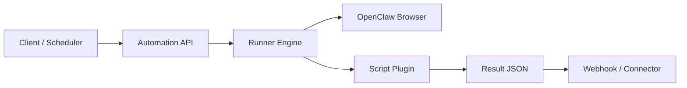

# OpenClaw Automation Kit

A production-focused framework for browser automation scripts with a clear plugin contract, API-first execution model, and optional messaging hooks.

This project is designed for teams that want to:
- Run reliable browser automations using OpenClaw
- Share and version automations as scripts
- Expose a stable API for execution and scheduling
- Keep channel delivery (WhatsApp/iMessage/Slack/email) pluggable

## Why this exists

Most automation projects fail on structure: scripts are ad-hoc, outputs are inconsistent, and adding contributors is risky.

This repository provides:
- **Script contract**: manifest + input/output schemas + deterministic entrypoint
- **Execution engine**: validate inputs, run script, normalize result
- **API hooks**: send results to webhooks or any downstream connector
- **Contribution model**: PR-friendly layout, CI checks, test expectations

## Architecture



## Repository layout

- `src/openclaw_automation/`: core engine and contract validator
- `examples/`: automation script examples (United, Singapore, ANA, BofA)
- `schemas/`: JSON schemas for manifests and run payloads
- `scripts/`: utility CLI wrappers
- `tests/`: contract + engine tests
- `docs/`: architecture and contribution docs

## Quickstart

### 1. Install

```bash
python3 -m venv .venv
source .venv/bin/activate
pip install -r requirements.txt
```

Configure keys locally:
```bash
cp .env.example .env
```
Then fill values per `docs/CONFIGURATION.md`.

## Platform support

The framework is intended to be cross-platform. Current practical testing has been on:
- macOS
- Linux (selected environments)

Windows support is expected but not yet broadly validated in real-world runs.  
If you hit Windows-specific issues, please open an issue or submit a PR.

### 2. Zero-credential quickstart (works immediately)

```bash
python -m openclaw_automation.cli run \
  --script-dir examples/public_page_check \
  --input '{"url":"https://www.yahoo.com","keyword":"news"}'
```

### 3. Validate example script contracts

```bash
python -m openclaw_automation.cli validate --script-dir examples/public_page_check
python -m openclaw_automation.cli validate --script-dir examples/united_award
python -m openclaw_automation.cli validate --script-dir examples/singapore_award
python -m openclaw_automation.cli validate --script-dir examples/ana_award
python -m openclaw_automation.cli validate --script-dir examples/bofa_alert
python -m openclaw_automation.cli validate --script-dir examples/github_signin_check
```

### 4. Run an award example

```bash
python -m openclaw_automation.cli run \
  --script-dir examples/united_award \
  --input '{"from":"SFO","to":["AMS","LIS","FCO"],"max_miles":120000,"days_ahead":30,"travelers":2,"cabin":"economy","credential_refs":{"airline_username":"openclaw/united/username","airline_password":"openclaw/united/password"}}'
```

### 5. Run from plain English

```bash
python -m openclaw_automation.cli run-query \
  --query "Search ANA award travel economy from SFO to HND for 2 travelers in next 30 days under 120k miles" \
  --credential-refs '{"airline_username":"openclaw/ana/username","airline_password":"openclaw/ana/password"}'
```

This mode is optimized for award-travel style requests (airline + route + cabin + travelers + mileage cap).

It also supports public page checks:

```bash
python -m openclaw_automation.cli run-query \
  --query "Open https://www.yahoo.com and count mentions of news"
```

More English task examples:

```bash
python -m openclaw_automation.cli run-query \
  --query "Load https://www.wikipedia.org and check if \"encyclopedia\" appears on it"

python -m openclaw_automation.cli run-query \
  --query "Search United award travel business from SFO to AMS,LIS,FCO for 2 travelers in next 30 days under 120k miles"
```

## OpenClaw integration model

Scripts can call OpenClaw CLI (`openclaw browser ...`) or use a wrapper module. This kit does not hardcode a single OpenClaw strategy.

Current recommended reasoning path for smart browser automation is Claude vision-capable workflows.  
We welcome PRs for alternative providers/adapters (OpenAI, Gemini, local models), as long as they meet contract + test requirements.

Recommended pattern:
1. Script performs deterministic browser steps
2. Script emits normalized results (`matches`, `raw_observations`, `errors`)
3. API layer handles delivery and retries

See `examples/united_award/runner.py` for the starter structure.

## Human-in-the-loop CAPTCHA

Read [`docs/CAPTCHA_HUMAN_LOOP.md`](docs/CAPTCHA_HUMAN_LOOP.md).

Recommended pattern:
1. Script detects challenge and captures screenshot + metadata.
2. Engine sends challenge event to user via webhook adapter.
3. User replies with solve instructions/token (for example tile indexes).
4. Script resumes with short-lived `resume_token`.

Also see:
- [`docs/MESSAGING_HUMAN_LOOP_SETUP.md`](docs/MESSAGING_HUMAN_LOOP_SETUP.md)
- [`docs/STARTER_EXAMPLES.md`](docs/STARTER_EXAMPLES.md)

## Security and credentials

Read [`docs/CREDENTIALS_AND_2FA.md`](docs/CREDENTIALS_AND_2FA.md) before deploying.

### Shared-responsibility warning

If you connect real account credentials + 2FA channels, this system can perform high-impact actions as that user.
You (the deployer/operator) are fully responsible for:
- secret storage hardening
- access control to the automation runtime
- approval gates for sensitive actions
- webhook and messaging channel security
- audit logging and incident response

If you cannot operate those controls safely, do not run credentialed automations.

It documents:
- macOS Keychain setup
- Linux/Windows secure store options
- webhook-based second-factor flow
- iMessage/WhatsApp connector scaffolding

Credential policy for this repo:
- Bring your own secrets store (OS keychain or cloud secret manager).
- Pass only `credential_refs` in script inputs.
- This project does **not** import/export credentials from password managers.

See also:
- [`docs/CONFIGURATION.md`](docs/CONFIGURATION.md)
- [`DISCLAIMER.md`](DISCLAIMER.md)

## Acceptable use

We do **not** condone use of this project to automate:
- accounts, systems, or data you do not legitimately own or have explicit authorization to access
- private sites/services without permission

Use is intended for:
- public websites
- your own authorized accounts and workflows

## Connectors (bring your own)

This repo intentionally keeps delivery adapters separate.

Use the webhook output from the runner to integrate with:
- WhatsApp API
- BlueBubbles / iMessage bridges
- Slack
- Email

## Building new automations

Read [`docs/NEW_AUTOMATION_PLAYBOOK.md`](docs/NEW_AUTOMATION_PLAYBOOK.md) for the recommended workflow to create production-grade new site automations.

## Concurrency and queueing

To keep automations from stepping on each other, use:
- centralized run queue
- resource locks (browser profile, site, messaging connector)
- explicit execution modes per script (`exclusive`, `profile_isolated`, `stateless`)

See:
- [`docs/QUEUE_AND_LOCKING.md`](docs/QUEUE_AND_LOCKING.md)

## Contribution

Read:
- `CONTRIBUTING.md`
- `docs/SCRIPT_CONTRACT.md`
- `docs/API_DESIGN.md`
- `docs/CONFIGURATION.md`

All PRs must include schema-valid manifests and runnable tests.  
Provider/integration PRs must include at least one deterministic test case we can run in CI.

## License

Apache-2.0
