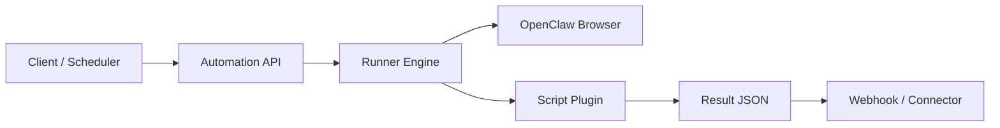

# OpenClaw Automation Kit

A production-focused framework for personal browser automations with a clear automation spec, API-first execution model, and optional messaging hooks.

This project is designed for people who want to:
- Run reliable browser automations using OpenClaw
- Share and version automations as scripts
- Expose a stable API for execution and scheduling
- Keep channel delivery (WhatsApp/iMessage/Slack/email) pluggable

## OpenClaw-first usage

This kit is optimized for OpenClaw users first:
- You can ask in plain English from chat.
- The automation runs in a real browser session.
- If 2FA is needed, default behavior is human-in-the-loop via chat prompt.
- If you configure connectors (iMessage/WhatsApp/email), the same 2FA step can be routed there.

Default 2FA pattern for OpenClaw chat:
1. automation pauses and asks for code,
2. you reply in chat with the code/token,
3. automation resumes.

Optional routing:
- iMessage (BlueBubbles connector)
- WhatsApp Cloud API connector
- Email connector

## 5-minute OpenClaw quickstart

If you only want to see it working fast:

```bash
git clone https://github.com/marcosathanasoulis/openclaw-automation-kit.git
cd openclaw-automation-kit
python3 -m venv .venv
source .venv/bin/activate
pip install -r requirements.txt
pip install -e .
python -m openclaw_automation.cli run-query --query "Check yahoo.com and tell me the top headlines"
python -m openclaw_automation.cli run-query --query "Check weather in New York in fahrenheit"
```

For a chat UI demo:

```bash
./demo/chat-demo/run_local_docker.sh
```

Open `http://127.0.0.1:8090`.

## What works out of the box vs. what needs a custom script

Many automations work immediately with no login:
- public page headlines/summaries/text checks
- website watch checks (required/forbidden phrase checks)
- chat-driven demo flows

Use a custom script when a site has:
- login/session requirements
- dynamic UI with multi-step forms/filters
- recurring challenge/2FA checkpoints
- domain-specific extraction needs (for example fare grids, account tables)

Short rule: **simple public checks = generic flow; complex authenticated workflows = custom script.**

### Model usage policy

- For public, no-credential checks (for example Yahoo/Wikipedia keyword/headline tasks), the kit uses deterministic extractors and does not require a separate LLM API key.
- For advanced browser-agent workflows (login flows, dynamic sites, hard UI reasoning), the BrowserAgent path currently depends on Claude vision-capable runs and requires `ANTHROPIC_API_KEY`.
- Goal: keep defaults simple for OpenClaw users and only require extra model keys when advanced automation is requested.

## What makes this useful

You can give plain-English instructions and have the automation execute real browser tasks, including authenticated flows:
- "Log in and check if business-class award seats to Europe are under 120k miles."
- "Open a dashboard and confirm if a specific metric changed today."
- "Go to my bank alerts page and report new notices."

For protected flows, it supports semi-automated human checkpoints:
- 2FA codes via chat first (default), then optional channel connectors (iMessage/WhatsApp/email)
- CAPTCHA pause + human solve + resume

For image-based challenges (CAPTCHA/screenshot review), the practical pattern is:
1. save challenge image locally,
2. publish it via a lightweight HTTP endpoint (local service, tunnel, or your own web server),
3. send that link in chat,
4. accept user reply token/instructions and resume the run.

This keeps humans in control while still automating the repetitive browser work.

## Why this exists

Most automation projects fail on structure: scripts are ad-hoc, outputs are inconsistent, and adding contributors is risky.

This repository provides:
- **Automation spec**: manifest + input/output schemas + deterministic entrypoint
- **Execution engine**: validate inputs, run script, normalize result
- **CLI hooks**: send results to your own webhooks/connectors
- **Contribution model**: PR-friendly layout, CI checks, test expectations

## Architecture



## Current status

| Component | Status |
|---|---|
| `examples/public_page_check` | Working |
| `library/*_award` without BrowserAgent integration | Placeholder mode (`mode=placeholder`, `real_data=false`) |
| `library/*_award` with BrowserAgent integration | Supported, depends on your private BrowserAgent runtime |
| CDP file lock | Implemented |
| Queue scheduler orchestration | Prototype present (`src/openclaw_automation/scheduler.py`), not wired into engine/CLI by default |
| CAPTCHA/2FA resume orchestration API | Implemented in private assistant stack; public kit currently docs/contracts only |
| HTTP API server (`/runs`, `/resume`) | Implemented in private assistant stack; public kit currently docs/contracts only |

## Repository layout

- `src/openclaw_automation/`: core engine and schema validator
- `library/`: PR-approved automation scripts
- `examples/`: onboarding/tutorial automations
- `schemas/`: JSON schemas for manifests and run payloads
- `scripts/`: utility CLI wrappers
- `tests/`: schema + engine tests
- `docs/`: architecture and contribution docs

## Quickstart

### 1. Install

If this is a fresh machine, do Git/SSH setup first:
- [`docs/DEVELOPER_SETUP.md`](docs/DEVELOPER_SETUP.md)

```bash
python3 -m venv .venv
source .venv/bin/activate
pip install -r requirements.txt
```

Configure keys locally:
```bash
cp .env.example .env
```
Then fill values per `docs/CONFIGURATION.md`.

### 2. Run the local chat demo (fastest path)

From repo root:

```bash
./demo/chat-demo/run_local_docker.sh
```

Open:

`http://127.0.0.1:8090`

Try:
- `Check yahoo.com and tell me the top headlines`
- `Run captcha demo`
- `Run 2FA demo`

Stop it:

```bash
docker rm -f openclaw-chat-demo
```

## Platform support

The framework is intended to be cross-platform. Current practical testing has been on:
- macOS
- Linux (selected environments)

Windows support is expected but not yet broadly validated in real-world runs.  
If you hit Windows-specific issues, please open an issue or submit a PR.

### 2. Zero-credential quickstart (works immediately)

```bash
python -m openclaw_automation.cli run \
  --script-dir examples/public_page_check \
  --input '{"url":"https://www.yahoo.com","keyword":"news"}'
```

### 2b. Demo Chat UI (container-first, Cloud Run ready)

Run locally (Docker, recommended):

```bash
./demo/chat-demo/run_local_docker.sh
```

Then open `http://127.0.0.1:8090` and try:
- `Check yahoo.com and tell me the top headlines`
- `Open https://www.wikipedia.org and count mentions of encyclopedia`
- `Check https://status.openai.com and summarize the page`
- `Run captcha demo` (safe, local human-in-loop mock challenge)
- `Run 2FA demo` (safe, local one-time-code handoff + resume)

Manual Python run (no Docker):

```bash
cd demo/chat-demo
python app.py
```

Deploy to Cloud Run (low-cost defaults):

```bash
cd demo/chat-demo
PROJECT_ID=your-gcp-project REGION=us-central1 SERVICE=openclaw-demo-chat ./deploy_cloud_run.sh
```

### 3. Validate example automation specs

```bash
python -m openclaw_automation.cli doctor --json
python -m openclaw_automation.cli validate --script-dir examples/public_page_check
python -m openclaw_automation.cli validate --script-dir library/united_award
python -m openclaw_automation.cli validate --script-dir library/singapore_award
python -m openclaw_automation.cli validate --script-dir library/ana_award
python -m openclaw_automation.cli validate --script-dir library/bofa_alert
python -m openclaw_automation.cli validate --script-dir library/github_signin_check
python -m openclaw_automation.cli validate --script-dir examples/weather_check
```

### 4. Run an award example

```bash
python -m openclaw_automation.cli run \
  --script-dir library/united_award \
  --input '{"from":"SFO","to":["AMS","LIS","FCO"],"max_miles":120000,"days_ahead":30,"travelers":2,"cabin":"economy","credential_refs":{"airline_username":"openclaw/united/username","airline_password":"openclaw/united/password"}}'
```

Important for real runs:
- Award scripts require a human-loop path for 2FA (and often CAPTCHA).
- You must either:
  - connect a 2FA/messaging connector, or
  - watch for challenge messages and reply with the required code/token manually.

### 5. Run from plain English

```bash
python -m openclaw_automation.cli run-query \
  --query "Search ANA award travel economy from SFO to HND for 2 travelers in next 30 days under 120k miles" \
  --credential-refs '{"airline_username":"openclaw/ana/username","airline_password":"openclaw/ana/password"}'
```

This mode is optimized for award-travel style requests (airline + route + cabin + travelers + mileage cap).

It also supports public page checks:

```bash
python -m openclaw_automation.cli run-query \
  --query "Open https://www.yahoo.com and count mentions of news"
```

More English task examples:

```bash
python -m openclaw_automation.cli run-query \
  --query "Load https://www.wikipedia.org and check if \"encyclopedia\" appears on it"

python -m openclaw_automation.cli run-query \
  --query "Search United award travel business from SFO to AMS,LIS,FCO for 2 travelers in next 30 days under 120k miles"
```

No-login library automations:

```bash
python -m openclaw_automation.cli run \
  --script-dir library/site_headlines \
  --input '{"url":"https://www.yahoo.com","max_items":8}'

python -m openclaw_automation.cli run \
  --script-dir library/site_text_watch \
  --input '{"url":"https://status.openai.com","must_include":["status"],"must_not_include":["outage"],"case_sensitive":false}'
```

## OpenClaw integration model

Scripts can call OpenClaw CLI (`openclaw browser ...`) or use a wrapper module.

### OpenClaw-first, not OpenClaw-only

This toolkit is intentionally portable: the core runner is not locked to one browser stack.
You can run automations with OpenClaw, Playwright, or other browser drivers inside script runners.

We recommend OpenClaw as the default path because it gives a strong base for:
- agent-friendly browser control
- human-in-the-loop 2FA/CAPTCHA workflows
- messaging-based checkpoints and resumes
- consistent orchestration across personal assistant automations

External BrowserAgent integration is supported via environment settings in
[`docs/CONFIGURATION.md`](docs/CONFIGURATION.md) (`OPENCLAW_USE_BROWSER_AGENT`, module path/name, CDP URL).

Current recommended reasoning path for smart browser automation is Claude vision-capable workflows.  
We welcome PRs for alternative providers/adapters (OpenAI, Gemini, local models), as long as they meet schema + test requirements.

Recommended pattern:
1. Script performs deterministic browser steps
2. Script emits normalized results (`matches`, `raw_observations`, `errors`)
3. API layer handles delivery and retries

See `library/united_award/runner.py` for the starter structure.

## How this kit extends the OpenClaw Browser Tool

The `openclaw-automation-kit` builds upon and significantly extends the foundational [`openclaw browser` tool](https://docs.openclaw.ai/tools/browser). While the `openclaw browser` provides the low-level primitives for programmatic browser control, this kit transforms those primitives into a robust framework for building, organizing, and executing advanced browser automations.

Here’s how this kit leverages and adds to the native functionality:

*   **Standardized Automation Specification:** Provides a declarative way (via `manifest.json` and input/output schemas) to define complex automation workflows, enabling consistent structure and easier understanding compared to raw browser commands.
*   **Intelligent Execution Engine:** Offers an execution layer that orchestrates the browser actions, handles data flow, validates inputs/outputs against schemas, and abstracts away the direct interaction with the low-level `openclaw browser` CLI.
*   **Human-in-the-Loop Patterns:** Provides documented event contracts and connector scaffolding for 2FA/CAPTCHA checkpoints (pause, collect user input, resume). Core end-to-end orchestration remains implementation-specific by deployment.
*   **Extensible AI-Driven Control:** Supports integration with external `BrowserAgent` implementations (which can leverage advanced AI models like Claude Vision or other agents) to perform complex UI reasoning and navigation that goes beyond deterministic scripting. This enables the automation of highly dynamic and challenging web interfaces.
*   **Reusable "Skills" and Marketplace Readiness:** Transforms individual automations into packaged, shareable "skills" with defined contracts, ready for publication and discovery, fostering a community of reusable browser automations.
*   **Simplified Credential Management:** Provides a structured approach for referencing user-owned credentials securely, integrating with OS-level secret stores (like macOS Keychain), rather than requiring credentials to be hardcoded or passed insecurely.
*   **Comprehensive Testing and Validation Framework:** Includes built-in tools for validating automation manifests and schemas, alongside smoke tests, ensuring the reliability and correctness of developed automations.

## Human-in-the-loop CAPTCHA

Read [`docs/CAPTCHA_HUMAN_LOOP.md`](docs/CAPTCHA_HUMAN_LOOP.md).

Recommended pattern (design reference, not built into core engine yet):
1. Script detects challenge and captures screenshot + metadata.
2. Engine sends challenge event to user via webhook adapter.
3. User replies with solve instructions/token (for example tile indexes).
4. Script resumes with short-lived `resume_token`.

Also see:
- [`docs/MESSAGING_HUMAN_LOOP_SETUP.md`](docs/MESSAGING_HUMAN_LOOP_SETUP.md)
- [`docs/STARTER_EXAMPLES.md`](docs/STARTER_EXAMPLES.md)
- [`docs/SCREENSHOT_LINKS.md`](docs/SCREENSHOT_LINKS.md)

## Security and credentials

Read [`docs/CREDENTIALS_AND_2FA.md`](docs/CREDENTIALS_AND_2FA.md) before deploying.

### Shared-responsibility warning

If you connect real account credentials + 2FA channels, this system can perform high-impact actions as that user.
Use only your own credentials in local/private secret stores and never share them.
You (the deployer/operator) are fully responsible for:
- secret storage hardening
- access control to the automation runtime
- approval gates for sensitive actions
- webhook and messaging channel security
- audit logging and incident response

If you cannot operate those controls safely, do not run credentialed automations.

### Branch safety for status updates

The status updater (`scripts/collect_automation_status.py --write-readme`) refuses to modify README on `main/master` by default.
Run it from your own branch, or explicitly override with `--allow-main-readme-update` in controlled CI.

That guide covers:
- macOS Keychain setup
- Linux/Windows secure store options
- webhook-based second-factor flow
- iMessage/WhatsApp connector scaffolding

Credential policy for this repo:
- Bring your own secrets store (OS keychain or cloud secret manager).
- Pass only `credential_refs` in script inputs.
- This project does **not** import/export credentials from password managers.
- If you already use a password manager, you can sync/copy credentials into your OS secret store
  (for example, Apple Keychain) and reference those entries from automations.

See also:
- [`docs/CONFIGURATION.md`](docs/CONFIGURATION.md)
- [`docs/PRIVATE_TESTING.md`](docs/PRIVATE_TESTING.md)
- [`DISCLAIMER.md`](DISCLAIMER.md)

## Acceptable use

We do **not** condone use of this project to automate:
- accounts, systems, or data you do not legitimately own or have explicit authorization to access
- private sites/services without permission

Use is intended for:
- public websites
- your own authorized accounts and workflows

## Connectors (bring your own)

This repo intentionally keeps delivery adapters separate.

Use the webhook output from the runner to integrate with:
- WhatsApp API
- BlueBubbles / iMessage bridges
- Slack
- Email

## Building new automations

Read [`docs/NEW_AUTOMATION_PLAYBOOK.md`](docs/NEW_AUTOMATION_PLAYBOOK.md) for the recommended workflow to create production-grade new site automations.

Promotion policy for community submissions:
- start in `examples/`
- promote to `library/` only after passing [`docs/AUTOMATION_PROMOTION.md`](docs/AUTOMATION_PROMOTION.md)

### When do you need a custom script?

Use built-in generic flows when the task is simple:
- open a public page
- extract text/headlines
- check for required/forbidden phrases

Create a custom script when any of these are true:
- login/session state is required
- site has dynamic multi-step UI behavior
- filtering/sorting rules are specific to one site
- 2FA/CAPTCHA checkpoints appear regularly
- output needs domain-specific normalization (for example award fare rows)

### How AI is used to get a script working

The intended workflow is iterative:
1. Ask an AI coding agent (Codex/Claude Code) to scaffold `examples/<name>`.
2. Run the script with real prompts and inspect output/traces/screenshots.
3. Ask the AI to patch selectors/steps/parsing based on those artifacts.
4. Repeat until output is stable and schema-valid.
5. Add tests + docs, then submit PR.
6. Promote to `library/` only after promotion checks pass.

In short: this toolkit gives structure, contracts, and debugging hooks so AI-assisted automation development can converge quickly instead of staying ad-hoc.

### Community contribution path (for complex sites)

1. Build first version in `examples/<automation_name>`.
2. Run validation + tests + smoke checks.
3. Include run evidence in PR (command + output excerpt).
4. Promote to `library/` only after passing [`docs/AUTOMATION_PROMOTION.md`](docs/AUTOMATION_PROMOTION.md).

This keeps shared automations trustworthy while still allowing fast community iteration.

## Marketplace skills

This repository ships publishable OpenClaw skill folders:
- `skills/openclaw-web-automation` (unified skill: basic + advanced)

Publishing and release steps are documented in:
- [`docs/OPENCLAW_MARKETPLACE.md`](docs/OPENCLAW_MARKETPLACE.md)

## Release smoke tests (no login required)

Manual:

```bash
./scripts/e2e_no_login_smoke.sh
```

CI:
- GitHub Actions workflow: `E2E No-Login Smoke`
- Runs lint/tests, manifest validation, public query path, and skill script smoke checks.

## Concurrency and queueing

To keep automations from stepping on each other, use:
- centralized run queue
- resource locks (browser profile, site, messaging connector)
- explicit execution modes per script (`exclusive`, `profile_isolated`, `stateless`)

See:
- [`docs/QUEUE_AND_LOCKING.md`](docs/QUEUE_AND_LOCKING.md)

## Getting Help

If you have questions, find a bug, or have a feature request, please [open an issue](https://github.com/marcosathanasoulis/openclaw-automation-kit/issues/new/choose) on GitHub.

## Contribution

Read:
- [`CONTRIBUTING.md`](CONTRIBUTING.md)
- [`SECURITY.md`](SECURITY.md)
- [`docs/AUTOMATION_PLANS.md`](docs/AUTOMATION_PLANS.md)
- [`docs/API_DESIGN.md`](docs/API_DESIGN.md)
- [`docs/CONFIGURATION.md`](docs/CONFIGURATION.md)

All PRs must include schema-valid manifests and runnable tests.  
Provider/integration PRs must include at least one deterministic test case we can run in CI.

## License

Apache-2.0

## Development note

This project was produced with AI-assisted implementation under experienced developer oversight and extensive testing.
That does not create any warranty or guarantee that the software will work for every environment or use case.
See [`DISCLAIMER.md`](DISCLAIMER.md) and [`SECURITY.md`](SECURITY.md).

<!-- AUTOMATION_STATUS:START -->
## Daily Automation Health

_Last generated (UTC): 2026-02-21 15:31:40_

| Automation | Location | Validate | Smoke | Status | Notes |
|---|---|---|---|---|---|
| `aeromexico.award_search` | `library/aeromexico_award` | pass | fail | ⚪ skip | no smoke input configured |
| `ana.award_search` | `library/ana_award` | pass | pass | ✅ pass | ok |
| `bofa.account_alerts` | `library/bofa_alert` | pass | pass | ✅ pass | ok |
| `delta.award_search` | `library/delta_award` | pass | fail | ⚪ skip | no smoke input configured |
| `github.signin_check` | `library/github_signin_check` | pass | pass | ✅ pass | ok |
| `singapore.award_search` | `library/singapore_award` | pass | pass | ✅ pass | ok |
| `web.site_headlines` | `library/site_headlines` | pass | fail | ⚪ skip | no smoke input configured |
| `web.site_text_watch` | `library/site_text_watch` | pass | fail | ⚪ skip | no smoke input configured |
| `united.award_search` | `library/united_award` | pass | pass | ✅ pass | ok |
| `examples.calculator` | `examples/calculator` | pass | fail | ⚪ skip | no smoke input configured |
| `web.public_page_check` | `examples/public_page_check` | pass | pass | ✅ pass | ok |
| `examples.stock_price_check` | `examples/stock_price_check` | pass | fail | ⚪ skip | no smoke input configured |
| `examples.weather_check` | `examples/weather_check` | pass | fail | ❌ fail | run failed |
| `examples.website_status` | `examples/website_status` | pass | fail | ⚪ skip | no smoke input configured |

<!-- AUTOMATION_STATUS:END -->
