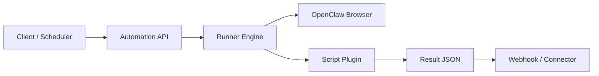

# OpenClaw Automation Kit

A production-focused framework for browser automation scripts with a clear plugin contract, API-first execution model, and optional messaging hooks.

This project is designed for teams that want to:
- Run reliable browser automations using OpenClaw
- Share and version automations as scripts
- Expose a stable API for execution and scheduling
- Keep channel delivery (WhatsApp/iMessage/Slack/email) pluggable

## Why this exists

Most automation projects fail on structure: scripts are ad-hoc, outputs are inconsistent, and adding contributors is risky.

This repository provides:
- **Script contract**: manifest + input/output schemas + deterministic entrypoint
- **Execution engine**: validate inputs, run script, normalize result
- **API hooks**: send results to webhooks or any downstream connector
- **Contribution model**: PR-friendly layout, CI checks, test expectations

## Architecture



## Repository layout

- `src/openclaw_automation/`: core engine and contract validator
- `examples/`: automation script examples (United, Singapore, BofA)
- `schemas/`: JSON schemas for manifests and run payloads
- `scripts/`: utility CLI wrappers
- `tests/`: contract + engine tests
- `docs/`: architecture and contribution docs

## Quickstart

### 1. Install

```bash
python3 -m venv .venv
source .venv/bin/activate
pip install -r requirements.txt
```

### 2. Validate example script contracts

```bash
python -m openclaw_automation.cli validate --script-dir examples/united_award
python -m openclaw_automation.cli validate --script-dir examples/singapore_award
python -m openclaw_automation.cli validate --script-dir examples/bofa_alert
```

### 3. Run an example

```bash
python -m openclaw_automation.cli run \
  --script-dir examples/united_award \
  --input '{"from":"SFO","to":["AMS","LIS","FCO"],"max_miles":120000,"days_ahead":30,"travelers":2}'
```

## OpenClaw integration model

Scripts can call OpenClaw CLI (`openclaw browser ...`) or use a wrapper module. This kit does not hardcode a single OpenClaw strategy.

Recommended pattern:
1. Script performs deterministic browser steps
2. Script emits normalized results (`matches`, `raw_observations`, `errors`)
3. API layer handles delivery and retries

See `examples/united_award/runner.py` for the starter structure.

## Connectors (bring your own)

## Security and credentials

Read `/Users/Marcos/code-projects/openclaw-automation-kit/docs/CREDENTIALS_AND_2FA.md` before deploying.

It documents:
- macOS Keychain setup
- Linux/Windows secure store options
- webhook-based second-factor flow
- iMessage/WhatsApp connector scaffolding

Credential policy for this repo:
- Bring your own secrets store (OS keychain or cloud secret manager).
- Pass only `credential_refs` in script inputs.
- This project does **not** import/export credentials from password managers.


This repo intentionally keeps delivery adapters separate.

Use the webhook output from the runner to integrate with:
- WhatsApp API
- BlueBubbles / iMessage bridges
- Slack
- Email

## Contribution

Read:
- `CONTRIBUTING.md`
- `docs/SCRIPT_CONTRACT.md`
- `docs/API_DESIGN.md`

All PRs must include schema-valid manifests and runnable tests.

## License

MIT
